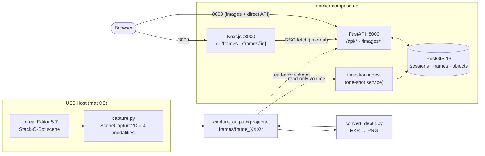
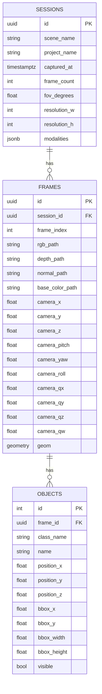

# Backlot — Architecture Presentation

**A walkthrough of the system, the decisions behind it, and what breaks first at scale.**

---

## 1 · System Architecture

**UE5 captures to disk, a one-shot service ingests into PostGIS, and a Docker stack serves the explorer.** Three runtime boundaries, one shared volume.



### Data Flow

1. **UE5 captures** — `capture.py` runs via `exec(open(...).read())` in the editor's embedded Python. A `CaptureRig` owns four `SceneCapture2D` actors sharing one pose, iterated across a Fibonacci hemisphere. Per-frame `camera.json` + `objects.json` emitted alongside renders.

2. **Host post-process** — `convert_depth.py` runs in the host venv (UE5's Python lacks pip packages). Converts float depth/normal/base_color EXRs into viewable PNGs while preserving the float originals as ML ground truth.

3. **Ingest** — `ingest.py` walks `capture_output/`, auto-discovers sessions, upserts all rows. Idempotent at every layer (§2).

4. **Serve** — FastAPI delivers JSON over `/api/*` and raw files over `/images/*`. Next.js renders three screens via RSC fetches inside the Docker network.

### What Runs Where

| Process | Runtime | Why there |
|---------|---------|-----------|
| `capture.py` | UE5 embedded Python | Needs SceneCapture2D, actor bounds |
| `convert_depth.py` | Host venv | Needs OpenCV + numpy (unavailable in UE5) |
| PostgreSQL + PostGIS | Docker container | Reproducible, spatial queries |
| FastAPI | Docker container | Mounts `capture_output/` read-only |
| Next.js | Docker container | Demo-ready on port 3000 |
| `ingest.py` | One-shot Docker service | Same image as backend |

---

## 2 · Database Design

**Three tables — sessions, frames, objects — with targeted indexes for each query pattern.** Paths stored relative to `capture_output/` so rows resolve on any host.



### Design Decisions

> **Key decision:** Three tables, not one per modality.
> Every query cuts across the same joins. Splitting modalities into sibling tables buys nothing at this scale.

- **Stable column names** — `session_id`, `frame_index`, `rgb_path`, `camera_x/y/z`, `bbox_x/y/width/height`. Additional columns (quaternion, geom) are all **nullable**.
- **Relative paths** — `"StackOBot/LVL_StackOBot/frames/frame_000/rgb.png"`, not absolute. Portable across machines.
- **Deterministic session IDs** via `uuid5(namespace, scene_name)` — re-capturing upserts, never orphans.

### Index Strategy

Each index exists to serve a specific query pattern:

| Index | Query it serves |
|-------|-----------------|
| `objects(class_name)` | "frames where class X is visible" |
| `objects(frame_id)` | FK join performance |
| `frames(session_id)` | Session scoping |
| `frames(session_id, frame_index)` UNIQUE | Idempotent upsert key |
| `frames(camera_z)` | Altitude range filters |
| `frames(geom)` GiST | PostGIS `ST_3DDWithin` spatial query |

### Idempotency

Re-ingestion is safe at every layer:

| Table | Strategy | Why |
|-------|----------|-----|
| sessions | `ON CONFLICT (id) DO UPDATE` | Metadata may evolve across re-captures |
| frames | Upsert on `(session_id, frame_index)` | Same frame slot can be re-captured |
| objects | Delete + bulk insert per frame | Actor populations change; clean replace avoids orphans |

<details>
<summary><strong>Example SQL queries (click to expand)</strong></summary>

```sql
-- 1. Frames where a given actor class is visible
SELECT f.frame_index, f.camera_x, f.camera_y, f.camera_z
FROM frames f
JOIN objects o ON o.frame_id = f.id
WHERE o.class_name = 'BP_Coin_C'
  AND o.visible = true
GROUP BY f.id
ORDER BY f.frame_index;

-- 2. Frames with camera_z above a threshold
SELECT frame_index, camera_x, camera_y, camera_z
FROM frames
WHERE camera_z > 1700
ORDER BY frame_index;

-- 3. Unique actor classes in a session
SELECT DISTINCT o.class_name
FROM objects o
JOIN frames f ON f.id = o.frame_id
WHERE f.session_id = $1
ORDER BY o.class_name;

-- 4. Frames captured within 500cm of a 3D point (PostGIS spatial query)
SELECT frame_index, camera_x, camera_y, camera_z
FROM frames
WHERE geom IS NOT NULL
  AND ST_3DDWithin(geom, ST_MakePoint(9000, 0, 2000), 500)
ORDER BY frame_index;
```

</details>

---

## 3 · API Design

**Eight endpoints. JSON over `/api/*`, raw files over `/images/*`.** Auto-generated OpenAPI at `localhost:8000/docs`.

| Method | Path | Purpose |
|--------|------|---------|
| GET | `/health` | Readiness check |
| GET | `/api/session` | Most-recent session + KPIs + classes |
| GET | `/api/sessions` | All sessions |
| GET | `/api/frames` | Filtered frame list |
| GET | `/api/frames/near` | PostGIS spatial query |
| GET | `/api/frames/{id}` | Frame detail + all objects |
| GET | `/api/classes` | Unique classes with counts |
| GET | `/images/{path}` | Static file serving |

Filter axes on `/api/frames`: `class_filter` (CSV), `visible_only`, `session_id`, `x/y/z_min/max` camera range.

<details>
<summary><strong>Response examples (click to expand)</strong></summary>

`GET /api/session`

```json
{
  "id": "65a9fde9-...",
  "scene_name": "LVL_StackOBot",
  "project_name": "StackOBot",
  "captured_at": "2026-04-22T...",
  "frame_count": 20,
  "unique_class_count": 34,
  "unique_classes": ["BP_Balance_C", "BP_BouncePad_C", "..."],
  "modalities": ["rgb", "depth", "normal", "base_color"],
  "fov_degrees": 90.0, "resolution_w": 1920, "resolution_h": 1080
}
```

`GET /api/frames?class_filter=BP_Coin_C&z_min=1700`

```json
{
  "total": 8,
  "frames": [
    {
      "id": "...", "frame_index": 12,
      "rgb_path": "<session_id>/frames/frame_012/rgb.png",
      "camera": {"x": 8384.07, "y": 600.95, "z": 1705.26},
      "actor_count": 243, "visible_count": 152
    }
  ]
}
```

`GET /images/StackOBot/LVL_StackOBot/frames/frame_012/rgb.png`

Returns the raw file directly (PNG, EXR, JSON). Path matches `rgb_path` from the frame response — the frontend constructs image URLs as `http://localhost:8000/images/{rgb_path}`. Backed by FastAPI `StaticFiles` mount over the `capture_output/` volume.

</details>

---

## 4 · Tech Stack Rationale

**Every choice maps to a concrete requirement — no résumé-driven decisions.**

> **Key decision:** Embedded Python over Remote Execution.
> Direct editor access, no network layer, no plugin dependencies. Debugging time dropped 90%.

| Choice | Why |
|--------|-----|
| **UE5 embedded Python** | Direct SceneCapture2D access; no plugin build cycle |
| **SceneCapture2D** | Synchronous per-tick — 4 modalities share exact same pose, zero drift |
| **Fibonacci hemisphere** | Uniform solid-angle coverage. Better than random or grid sampling |
| **PostgreSQL + PostGIS** | B-tree for filter queries; `ST_3DDWithin` for 3D spatial proximity |
| **SQLAlchemy 2.0** | Typed ORM with `Mapped[…]` — schema change is a one-file PR |
| **FastAPI** | Free OpenAPI docs, first-class Pydantic, trivial CORS + StaticFiles |
| **Next.js 16 (App Router)** | RSC for server-authoritative data; file-based routing matches the three-screen layout |
| **React Three Fiber** | 3D trajectory viewer with orbit controls + waypoint interaction |
| **Framer Motion** | Spring physics + stagger animations without heavyweight state |
| **UE5 ToolMenus API** | Native editor menu — no widget blueprint or plugin build needed |
| **Docker Compose** | One-file reproducibility |

---

## 5 · Trade-offs, Scale, & Retrospective

**What I chose not to build, what breaks at scale, and what I learned along the way.**

### Intentional Scope Limits

- **Sync ingestion** — 20 frames ingest in ~200ms. Async workers are overhead without a bottleneck.
- **No Alembic** — `Base.metadata.create_all` is fine for a single-schema prototype; swap-in is one file.
- **No auth / rate-limiting / HTTPS** — out of scope for a local explorer.
- **No test suite** — prioritized end-to-end verified runs. A pytest scaffold is one hour of work.

### What Breaks at 10k Sessions × 1M+ Frames

| Bottleneck | Fix |
|------------|-----|
| `unique_classes` computed eagerly | Materialized view, refresh on ingest |
| Image serving through Python | S3 + CDN; DB stores keys only |
| Flat `capture_output/` directory | Partition by UUID prefix (`65/a9/fde9…/`) |
| `objects` table at 50M rows | Partition by `session_id`; analytics to columnar store |
| Single-threaded ingest | Per-frame parallelism; `COPY` over INSERT |
| No caching | Redis for hot reads |
| Full frame listing | Cursor-based pagination (envelope already has `total`) |

> **What doesn't break:** the core schema. Three tables with sane indexes handle 50M-row joins without structural changes.

### Multi-User Collaboration

Adding collaboration requires: `users` table + `sessions.owner_id` + row-level security, `SELECT … FOR UPDATE` for concurrent ingest, SSE for realtime notifications, and S3 with signed URLs replacing local file serving.

### UE5 Retrospective

> **Key decision:** Abandoned Remote Execution after hitting cascading issues — macOS multicast binding, port conflicts, missing MRQ plugins. Rewrote as a single embedded Python script. Zero network, zero plugin dependencies.

What worked in the fresh approach:

- **Four modalities from one rig** — `CaptureRig` manages four `SceneCapture2D` actors sharing exact same pose per frame
- **Pure-stdlib projection math** — 2D bbox from 3D AABB + rotator basis, testable outside the editor
- **Post-process as separate step** — `convert_depth.py` in the host venv where iteration is fast
- **Editor menu for one-click capture** — `ToolMenus` API registers a "Backlot" menu in the UE5 menu bar. Mode selection, presets, and config editing without touching the Python console. Installed globally via `scripts/install_editor_menu.py` — writes a bootstrap to `~/Documents/UnrealEngine/Python/init_unreal.py` so every UE5 project picks it up on startup

### Camera Modes

8 automated trajectory modes, each designed for a different capture scenario:

| Mode | Strategy | Best for |
|------|----------|----------|
| `orbit` | Fibonacci hemisphere around scene bounds | Full scene overview — uniform angular coverage |
| `local_orbit` | Fibonacci hemisphere at configurable radius | Close-up inspection of a specific area |
| `look_around` | Fixed position, 360° rotation | Interior spaces — capture everything visible from one spot |
| `multi_look` | N viewpoints, each sweeping a direction arc | Room-scale scanning with multiple perspectives |
| `walk_through` | Linear walk along viewport heading | Corridors, hallways — linear environments |
| `sphere_interior` | Inward-looking poses on sphere surface | Enclosed environments — looking in from outside |
| `random_walk` | Random steps with seeded RNG | Organic coverage of irregular spaces |
| `spline` | Catmull-Rom through random control points | Smooth cinematic trajectories |

Config only shows parameters relevant to the selected mode — `radius_cm` appears for `local_orbit` but not `look_around`.

### Additional Data Worth Extracting

- **Optical flow** — adjacent frame pairs through UE5's velocity buffer (`SceneTexture:Velocity`). Enables motion estimation and temporal consistency checks for ML training.
- **Material IDs** — per-pixel material type (metal, glass, fabric, etc.) via a custom post-process material reading `MaterialID`. Useful for domain randomization and material-aware rendering.
- **Light probes** — per-frame HDR environment cubemap captures at camera position. Enables relighting and PBR ground truth for inverse rendering research.
- **Skeleton / joint data** — for scenes with animated characters, export bone transforms per frame. Extends the pipeline to human pose estimation datasets.

### With Another Week

1. **Near-plane AABB clipping** — actors straddling the near plane get under-estimated bboxes (30-line fix)
2. **Mission-driven camera paths** — `generate_mission_from_brief(brief, scene_info) → trajectory`
3. **Per-frame capture telemetry** — `frame_telemetry` table for performance profiling
4. **Pydantic validation on output JSONs** — catch schema drift between capture and ingest
5. **pytest scaffold** — integration tests against a real DB, not mocks
